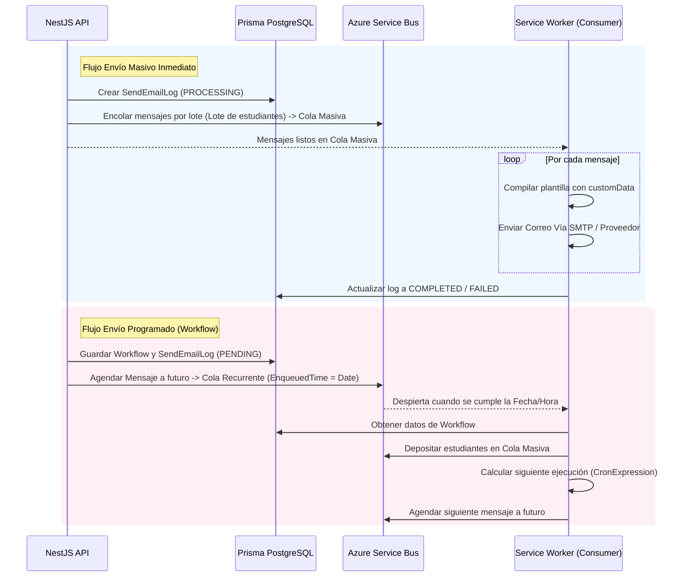

# MailStudio - Backend API Documentation

Este repositorio contiene el backend de MailStudio, un sistema progresivo basado en [NestJS](https://nestjs.com/) para la gestión de plantillas de correo y envíos masivos.

---

## 🖼️ Módulo de Imágenes (ImagesModule)

El módulo de imágenes gestiona la carga, almacenamiento en la nube, consulta, actualización y eliminación de los recursos visuales utilizados en las plantillas de correo.

- **Ruta base**: `/images`
- **Controlador**: [ImagesController](file:///d:/GitHub/MailStudio-Back/src/images/images.controller.ts)
- **Servicio**: [ImagesService](file:///d:/GitHub/MailStudio-Back/src/images/images.service.ts)
- **Módulo**: [ImagesModule](file:///d:/GitHub/MailStudio-Back/src/images/images.module.ts)

---

### 📡 Endpoints de la API

| Método | Ruta | Descripción | Consumo |
| :--- | :--- | :--- | :--- |
| **POST** | `/images/:nameImg` | Cargar una nueva imagen | `multipart/form-data` |
| **GET** | `/images` | Listar imágenes paginadas y filtradas | `application/json` |
| **GET** | `/images/:id` | Obtener el detalle de una imagen por ID | `application/json` |
| **PATCH** | `/images/:id` | Actualizar el nombre de una imagen | `application/json` |
| **DELETE** | `/images/:id` | Eliminar una imagen | `application/json` |

---

### 🛠️ Detalle de Endpoints

#### 1. Cargar Imagen (`POST /images/:nameImg`)

Permite subir un archivo de imagen y registrar su información en la base de datos vinculándola a un nombre identificador.

*   **Parámetros de Ruta (Params)**:
    *   `nameImg` (string, requerido, 1-50 caracteres): Nombre asignado a la imagen en la URL final.
*   **Encabezados (Headers)**:
    *   `Content-Type: multipart/form-data`
*   **Cuerpo de la Petición (Body)**:
    *   `file` (binary, requerido): Archivo de imagen a subir.
*   **Respuesta Exitosa (201 Created)**:
    ```json
    {
      "id": "uuid-de-la-imagen",
      "name": "mi-imagen-01",
      "url": "nombre-de-archivo.png",
      "createdAt": "2026-06-02T20:30:00.000Z",
      "updatedAt": "2026-06-02T20:30:00.000Z"
    }
    ```

---

#### 2. Listar Imágenes (`GET /images`)

Obtiene una lista de imágenes almacenadas con soporte para paginación y filtrado por nombre.

*   **Parámetros de Consulta (Query)**:
    *   `page` (number, opcional, mínimo 1, default: 1): Página actual de resultados.
    *   `size` (number, opcional, mínimo 1, default: 10): Cantidad de registros por página.
    *   `name` (string, opcional, 0-100 caracteres): Término de búsqueda para filtrar imágenes por nombre (búsqueda insensible a mayúsculas/minúsculas).
*   **Respuesta Exitosa (200 OK)**:
    ```json
    {
      "data": [
        {
          "id": "uuid-imagen-1",
          "name": "banner-bienvenida",
          "url": "banner.jpg",
          "createdAt": "2026-06-02T20:00:00.000Z"
        }
      ],
      "meta": {
        "total": 1,
        "page": 1,
        "size": 10,
        "totalPages": 1
      }
    }
    ```

---

#### 3. Obtener Imagen por ID (`GET /images/:id`)

Recupera los detalles de una imagen específica mediante su ID único.

*   **Parámetros de Ruta (Params)**:
    *   `id` (string, requerido): Identificador único de la imagen en formato UUID.
*   **Respuesta Exitosa (200 OK)**:
    ```json
    {
      "id": "uuid-imagen-1",
      "name": "banner-bienvenida",
      "url": "banner.jpg",
      "createdAt": "2026-06-02T20:00:00.000Z",
      "updatedAt": "2026-06-02T20:00:00.000Z"
    }
    ```
*   **Errores Comunes**:
    *   `404 Not Found`: Si la imagen con el ID proporcionado no existe en la base de datos.

---

#### 4. Actualizar Imagen (`PATCH /images/:id`)

Actualiza el nombre descriptivo de una imagen existente.

*   **Parámetros de Ruta (Params)**:
    *   `id` (string, requerido): Identificador único de la imagen.
*   **Cuerpo de la Petición (Body)**:
    ```json
    {
      "name": "nuevo-nombre-imagen"
    }
    ```
    *   `name` (string, opcional, 1-50 caracteres): Nuevo nombre descriptivo para la imagen.
*   **Respuesta Exitosa (200 OK)**:
    ```json
    {
      "id": "uuid-imagen-1",
      "name": "nuevo-nombre-imagen",
      "url": "banner.jpg",
      "createdAt": "2026-06-02T20:00:00.000Z",
      "updatedAt": "2026-06-02T20:35:00.000Z"
    }
    ```

---

#### 5. Eliminar Imagen (`DELETE /images/:id`)

Remueve una imagen del almacenamiento en la nube y de la base de datos.

*   **Parámetros de Ruta (Params)**:
    *   `id` (string, requerido): Identificador único de la imagen.
*   **Reglas de Validación**:
    *   Una imagen **no se puede eliminar** si está asociada a alguna plantilla de correo (`TemplateImage`).
*   **Respuesta Exitosa (200 OK)**:
    ```json
    {
      "id": "uuid-imagen-1",
      "name": "nuevo-nombre-imagen",
      "url": "banner.jpg",
      "createdAt": "2026-06-02T20:00:00.000Z",
      "updatedAt": "2026-06-02T20:35:00.000Z"
    }
    ```
*   **Errores Comunes**:
    *   `400 Bad Request`: Si la imagen está asociada a una plantilla y no puede eliminarse.

---

## 📜 Módulo de Logs de Envío de Correos (SendEmailLogsModule)

Este módulo se encarga del registro, seguimiento, historial y actualizaciones en tiempo real del estado de los trabajos de envío de correos masivos y programados.

- **Ruta base**: `/send-email-logs`
- **Controlador**: [SendEmailLogsController](file:///d:/GitHub/MailStudio-Back/src/send-email-logs/send-email-logs.controller.ts)
- **Servicio**: [SendEmailLogsService](file:///d:/GitHub/MailStudio-Back/src/send-email-logs/send-email-logs.service.ts)
- **Módulo**: [SendEmailLogsModule](file:///d:/GitHub/MailStudio-Back/src/send-email-logs/send-email-logs.module.ts)

---

### 📡 Endpoints de la API

| Método | Ruta | Descripción | Consumo |
| :--- | :--- | :--- | :--- |
| **PATCH** | `/send-email-logs/:id/status` | Actualizar el estado de un envío específico | `application/json` |
| **GET** | `/send-email-logs` | Listar el historial de logs de envío paginado | `application/json` |

---

### 💼 Estados del Envío (`JobStatus`)

Los estados válidos del proceso de envío definidos en la base de datos (Prisma Enum) son:
- `PENDING`: Envío en espera de procesamiento.
- `PROGRAMMED`: Envío agendado para ejecutarse en una fecha futura.
- `PROCESSING`: Envío actualmente en ejecución y transmitiendo mensajes.
- `COMPLETED`: Envío finalizado con éxito para todos los destinatarios.
- `FAILED`: Envío finalizado con errores o interrumpido.

---

### 🛠️ Detalle de Endpoints

#### 1. Actualizar Estado del Log (`PATCH /send-email-logs/:id/status`)

Permite actualizar manualmente o a través de workers el estado del trabajo de envío, además de emitir notificaciones en tiempo real al cliente vía Server-Sent Events (SSE).

*   **Parámetros de Ruta (Params)**:
    *   `id` (string, requerido): Identificador del log de envío.
*   **Cuerpo de la Petición (Body)**:
    *   `status` (JobStatus, requerido): Nuevo estado del trabajo. Debe ser un valor válido del enum `JobStatus`.
    *   `message` (string, opcional): Mensaje de error, advertencia o detalle del estado del proceso.
*   **Comportamiento**:
    *   Actualiza el registro en base de datos.
    *   Notifica inmediatamente a las aplicaciones web activas mediante SSE (`SseService`), disparando un evento con acción `UPDATE` y entidad `EMAIL_LOG`.
*   **Respuesta Exitosa (200 OK)**:
    ```json
    {
      "id": "uuid-del-log",
      "subject": "Comunicado Importante UAI",
      "priority": "HIGH",
      "status": "COMPLETED",
      "message": "Enviado con éxito a todos los destinatarios.",
      "content": { "htmlContent": "..." },
      "templateId": "uuid-del-template",
      "templateFileId": null,
      "cc": [],
      "bcc": [],
      "studentEmails": [ "estudiante1@uai.cl", "estudiante2@uai.cl" ],
      "filters": [],
      "createdAt": "2026-06-02T21:40:00.000Z",
      "sender": {
        "id": "uuid-del-staff",
        "name": "Kevin",
        "email": "kevin@uai.cl",
        "role": "ADMIN"
      },
      "workflow": null
    }
    ```

---

#### 2. Obtener Historial de Logs (`GET /send-email-logs`)

Obtiene la lista paginada y filtrada del historial de logs de envío de correos, con optimización opcional de la información de destinatarios.

*   **Parámetros de Consulta (Query)**:
    *   `page` (number, opcional, default: 1): Página actual de resultados.
    *   `size` (number, opcional, default: 10): Cantidad de registros por página.
    *   `emailDetails` (boolean, opcional, default: `false`):
        *   Si es `true`, la respuesta incluirá la lista completa de direcciones de correos (`studentEmails`) para cada log.
        *   Si es `false` (por defecto), la respuesta reemplaza el arreglo de correos por la cantidad de elementos (`studentEmails` como un número) para reducir el tamaño del payload.
    *   `status` (JobStatus, opcional): Filtra los registros para mostrar solo aquellos que coincidan con el estado especificado.
*   **Respuesta Exitosa (200 OK - con `emailDetails = false`)**:
    ```json
    {
      "data": [
        {
          "id": "uuid-del-log",
          "subject": "Comunicado Importante UAI",
          "priority": "HIGH",
          "status": "PROCESSING",
          "message": null,
          "content": { "htmlContent": "..." },
          "templateId": "uuid-del-template",
          "templateFileId": null,
          "cc": [],
          "bcc": [],
          "studentEmails": 150,
          "studentCount": 150,
          "filters": [],
          "createdAt": "2026-06-02T21:40:00.000Z",
          "sender": {
            "id": "uuid-del-staff",
            "name": "Kevin",
            "email": "kevin@uai.cl",
            "role": "ADMIN"
          },
          "workflow": null
        }
      ],
      "meta": {
        "total": 1,
        "page": 1,
        "size": 10,
        "totalPages": 1
      }
    }
    ```

---

## ✉️ Módulo de Envío de Correos (SendEmailsModule)

Este módulo es la puerta de enlace encargada de procesar las solicitudes de envíos, integrarse con colas de mensajería (Azure Service Bus) y delegar el procesamiento masivo y programado a workers/consumers especializados.

- **Ruta base**: `/mail-sender`
- **Controlador**: [SendEmailsController](file:///d:/GitHub/MailStudio-Back/src/send-emails/send-emails.controller.ts)
- **Servicio**: [SendEmailsService](file:///d:/GitHub/MailStudio-Back/src/send-emails/send-emails.service.ts)
- **Módulo**: [SendEmailsModule](file:///d:/GitHub/MailStudio-Back/src/send-emails/send-emails.module.ts)

---

### 📡 Endpoints de la API

| Método | Ruta | Descripción | Consumo |
| :--- | :--- | :--- | :--- |
| **POST** | `/mail-sender/massive` | Iniciar un envío masivo e inmediato | `application/json` |
| **POST** | `/mail-sender/workflow` | Crear y programar un envío (Único o Recurrente) | `application/json` |

---

### 🛠️ Detalle de Endpoints

#### 1. Envíos Masivos Inmediatos (`POST /mail-sender/massive`)

Procesa una lista de destinatarios para su entrega inmediata a través de la cola de Azure Service Bus.

*   **Cuerpo de la Petición (Body)**:
    *   `students` (array, requerido): Lista de estudiantes. Cada elemento debe ser un objeto con `email` (string, requerido) y opcionalmente `name` y `customData` (objeto clave-valor para reemplazo de variables).
    *   `templateId` o `templateFileId` (string, opcional, 26 caracteres): ID de la plantilla estructurada o plantilla de archivo a enviar. Debe enviarse uno y solo uno.
    *   `subject` (string, requerido): Asunto del correo.
    *   `priority` (enum, opcional): `NORMAL` o `HIGH`.
    *   `cc` / `bcc` (array de strings, opcional): Destinatarios en copia o copia oculta. Max 10.
    *   `staffId` (string, requerido): ID del administrador que inicia el envío.
    *   `filters` (objeto, opcional): Filtros de segmentación aplicados.
*   **Comportamiento**:
    1.  Crea un registro `SendEmailLog` en la base de datos con estado `PROCESSING`.
    2.  Separa la lista de estudiantes y genera lotes de mensajes (`ServiceBusMessageBatch`) optimizando la capacidad máxima permitida por Azure Service Bus.
    3.  Envía los lotes a la cola de envío masivo inmediato (`ENVS.AZURE_BUS.QUEUE_NAME`) de forma asíncrona con un control de concurrencia máxima (`maxConcurrentBatches`).
    4.  Al finalizar el encolado de todos los mensajes, actualiza el `SendEmailLog` a `COMPLETED` (o `FAILED` si ocurre algún error) y emite un evento SSE para actualizar la UI del usuario.

---

#### 2. Envíos Programados y Recurrentes (`POST /mail-sender/workflow`)

Crea flujos de trabajo programados para ejecutarse una única vez en el futuro, o de forma repetitiva bajo reglas de recurrencia temporales.

*   **Cuerpo de la Petición (Body - `SendEmailWorkflowDto`)**:
    *   `name` (string, requerido): Nombre identificador del flujo.
    *   `description` / `subject` (string, opcional): Descripción y asunto del flujo.
    *   `students` (array de objetos, requerido): Lista de destinatarios.
    *   `templateId` / `templateFileId` (string, opcional): Plantilla asociada.
    *   `frequency` (enum, opcional): Frecuencia (`ONCE`, `DAILY`, `WEEKLY`, `MONTHLY`, `YEARLY`). Por defecto es `ONCE`.
    *   `date` (Date, opcional): Fecha específica para programación única (`ONCE`).
    *   `hour` / `minute` (number, requerido): Hora (0-23) y minuto (0-59) de ejecución.
    *   `daysOfWeek` (array de numbers, opcional): Días de la semana para recurrencia (1 = Lunes, 7 = Domingo).
    *   `dayOfMonth` / `monthOfYear` (number, opcional): Reglas del día del mes o mes del año.
    *   `lastDayOfMonth` (boolean, opcional): Ejecutar el último día del mes.
    *   `occurrences` / `repeatUntil` / `neverEnds` (opcional): Límites de repetición.
    *   `createdBy` (string, requerido): ID de usuario creador.

---

### ⚙️ Arquitectura de Mensajería y Service Workers

La ejecución física de los envíos no satura el servidor HTTP principal de NestJS gracias a una arquitectura basada en **Azure Service Bus** y **Service Workers (Consumers)** independientes.



#### 1. Cola de Envíos Masivos (Immediate Queue)
*   **Configuración**: `ENVS.AZURE_BUS.QUEUE_NAME`
*   **Propósito**: Recibe los mensajes individuales por cada estudiante/destinatario.
*   **Flujo del Worker**: El worker consume estos mensajes en paralelo, compila el contenido HTML del correo reemplazando las variables (`{{FullDate:DD/MM/YYYY}}`, `{{student.name}}`, etc.) con la información personalizada (`customData`) del estudiante, y realiza el envío de SMTP definitivo a través del proveedor de correos.

#### 2. Cola de Recurrencia y Agendamiento (Recurrence Queue)
*   **Configuración**: `ENVS.AZURE_BUS.AZURE_QUEUE_RECURRENCE_NAME`
*   **Propósito**: Almacena de forma agendada el activador del flujo de trabajo (`workflowId`).
*   **Agendamiento Único (`ONCE`)**:
    *   El API calcula la fecha y hora futura (`firstRun`) y agenda el mensaje en Azure Service Bus utilizando `scheduleMessages`. El mensaje permanece oculto en la cola hasta alcanzar esa fecha.
*   **Agendamiento Recurrente (`DAILY`, `WEEKLY`, etc.)**:
    1.  El API convierte las reglas de recurrencia en una expresión **Cron** (ej: `30 9 * * 1` para todos los lunes a las 09:30 AM).
    2.  Calcula la fecha de la primera ejecución (`firstRun`) y la agenda en Azure Service Bus.
    3.  Cuando el tiempo se cumple, el Service Worker recibe el mensaje del activador, gatilla el envío masivo cargando los estudiantes y enviándolos a la *Cola Masiva*, y finalmente evalúa el cron para calcular la fecha del siguiente envío, volviendo a programar otro mensaje agendado en la *Cola Recurrente*. Este ciclo se repite hasta cumplir las condiciones de parada (`occurrences` o `repeatUntil`).

---

## 🛠️ Servicios Globales Compartidos (Shared Services)

Este bloque detalla los servicios internos compartidos responsables de la comunicación HTTP genérica y la integración técnica con la plataforma externa de administración de archivos (File Manager).

---

### 📁 1. Servicio Gestor de Archivos (FileManagerService)

Encargado de la subida, categorización, optimización y eliminación de recursos multimedia e informativos mediante APIs externas (conectadas internamente a almacenamiento y CDNs como Cloudinary).

- **Ubicación del Archivo**: [file-manager.service.ts](file:///d:/GitHub/MailStudio-Back/src/services/file-manager.service.ts)

#### 🚀 Integración y Mecanismo de Reintentos (Retry System)
Las llamadas de red para manipulación de archivos implementan un robusto sistema de reintentos asíncrono (`withRetry`) con retroceso lineal para tolerar fallas de red intermitentes:
- **Límite de Reintentos**: Configurable mediante `ENVS.FILE_MANAGER.MAX_RETRIES`.
- **Intervalo de Espera**: Incrementa proporcionalmente a cada intento fallido (`RETRY_DELAY * attempt`).

#### 🗂️ Rutas de Destino por Mimetype
El servicio calcula dinámicamente el folder de destino codificando el path base junto con subcarpetas específicas según el tipo de archivo:
*   `image/*` (Imágenes normales): Carpeta de imágenes.
*   `image/*` (Imágenes crudas para plantillas): Carpeta RAW de imágenes.
*   `video/*` (Videos): Carpeta de videos.
*   `application/pdf` (Documentos PDF): Carpeta de PDFs.
*   `text/html` (Archivos HTML): Carpeta de HTMLs.
*   `text/plain` (Texto plano): Carpeta de archivos TXT.
*   Otros: Carpeta general.

#### 🔧 Métodos Principales

##### A. Subir Imagen General (`upload`)
Carga archivos de imagen de interfaz de usuario.
*   **Parámetros**: `file` (Express.Multer.File).
*   **Endpoint destino**: `POST /<IMAGE_ENDPOINT>/<IMAGE_FOLDER>?format=<FORMAT>&quality=<QUALITY>`
*   **Respuesta**: Devuelve el string del link seguro `secure_url`.

##### B. Subir Archivo de Plantilla (`uploadTemplateFile`)
Carga adjuntos que se asociarán a los correos, aplicando diferentes optimizaciones y flujos de almacenamiento según el tipo de archivo.
*   **Parámetros**: `file` (Express.Multer.File).
*   **Lógica Especial para PDFs**: Realiza optimización automática y solicita generar una miniatura de portada (`optimize=true&generate_cover=true&format=avif`).
*   **Respuesta**:
    *   Para PDFs: `{ url: string, coverUrl: string }` (URL del documento y URL de su portada generada).
    *   Otros archivos: `{ url: string }`.

##### C. Eliminar Archivo (`delete`)
Remueve el archivo del servidor de almacenamiento de forma definitiva.
*   **Parámetros**:
    *   `imageUrl` (string): URL completa del archivo a eliminar.
    *   `resourceType` (string, default: `'image'`): Tipo de recurso (`image`, `video`, `raw`).
*   **Endpoint destino**: `DELETE /<ADMIN_ENDPOINT>/<FILE_PATH>?resource_type=<TYPE>`
*   **Comportamiento**: Convierte la URL del archivo reemplazando las barras por pipes (`/` a `|`) mediante `convertToPipe()` antes de enviarlo codificado al endpoint de administración. Valida que el resultado devuelto sea exactamente `"ok"`.

---

### 🌐 2. Cliente de Peticiones HTTP (`connectRequest`)

Un envoltorio (wrapper) genérico sobre la API nativa de JavaScript `fetch` para simplificar las solicitudes salientes, parsear respuestas y centralizar el manejo de errores.

- **Ubicación del Archivo**: [fetch.service.ts](file:///d:/GitHub/MailStudio-Back/src/services/fetch.service.ts)

#### 📋 Características Clave
*   **Detección de URLs**: Si el endpoint provisto no comienza con `http`, le antepone automáticamente el prefijo `/api/`.
*   **Detección de FormData**: Si el cuerpo (`body`) es una instancia de `FormData`, omite la cabecera `Content-Type` para permitir al navegador definir las cabeceras multipart correctas con el boundary. Si es un objeto convencional, le aplica `JSON.stringify` e incluye `'Content-Type': 'application/json'`.
*   **Manejo de Errores Integrado**: Si la respuesta no es exitosa (`response.ok` es `false`), lee el cuerpo JSON de error (si existe) y lanza un objeto tipado como `ApiError`:
    ```typescript
    export type ApiError = {
        message : string;
        code    : string;
        status? : number;
        data?   : unknown;
    }
    ```
*   **Detección de Respuestas Sin Contenido**: Retorna `true` automáticamente si recibe un código HTTP `204` (No Content).

---

### 🔢 3. Enums de Códigos y Verbos HTTP (`METHOD`)

Define los verbos estándar de la especificación HTTP utilizados de forma consistente para las llamadas a servicios externos.

- **Ubicación del Archivo**: [http-codes.ts](file:///d:/GitHub/MailStudio-Back/src/services/http-codes.ts)

```typescript
export enum METHOD {
    GET     = 'GET',
    POST    = 'POST',
    DELETE  = 'DELETE',
    PUT     = 'PUT',
    PATCH   = 'PATCH',
}
```

---

## 📁 Archivos de Plantilla (TemplateFilesModule)

El módulo de archivos de plantilla gestiona el ciclo de vida de los **recursos basados en archivos externos** (PDFs, videos, HTMLs, archivos de texto plano TXT u otros documentos) que sirven como base o contenido adjunto para los correos electrónicos.

A diferencia de las plantillas de correo estándar estructuradas (HTML puro en base de datos), este módulo permite cargar archivos externos y enviarlos de forma embebida o como enlaces de descarga dinámicos compilando sus datos o mostrando una previsualización de su contenido.

- **Ruta base**: `/template-files`
- **Controlador**: [TemplateFilesController](file:///d:/GitHub/MailStudio-Back/src/template-files/template-files.controller.ts)
- **Servicio**: [TemplateFilesService](file:///d:/GitHub/MailStudio-Back/src/template-files/template-files.service.ts)
- **Módulo**: [TemplateFilesModule](file:///d:/GitHub/MailStudio-Back/src/template-files/template-files.module.ts)

---

### 📡 Endpoints de la API

| Método | Ruta | Descripción | Consumo |
| :--- | :--- | :--- | :--- |
| **POST** | `/template-files` | Cargar y crear una nueva plantilla de archivo | `multipart/form-data` |
| **GET** | `/template-files` | Listar plantillas de archivo paginadas y filtradas | `application/json` |
| **GET** | `/template-files/:id` | Obtener el detalle de una plantilla de archivo | `application/json` |
| **PATCH** | `/template-files/:id` | Actualizar metadatos de una plantilla de archivo | `application/json` |
| **DELETE** | `/template-files/:id` | Eliminar una plantilla de archivo física y lógicamente | `application/json` |

---

### 📂 Tipos de Adjuntos (`AttachmentType`)

El sistema detecta automáticamente el mimetype del archivo cargado y asigna uno de los siguientes tipos:
- `IMAGE`: Archivos de imagen (JPEG, PNG, etc.) cargados como plantilla.
- `VIDEO`: Archivos de video (MP4, etc.) para reproducción embebida.
- `PDF`: Documentos PDF (incluye generación automática de una imagen de portada/cover).
- `HTML`: Documentos HTML que se leen y renderizan directamente.
- `TXT`: Archivos de texto plano cuyo contenido se extrae y formatea con saltos de línea `<br>`.
- `OTHER`: Cualquier otro tipo de archivo no clasificado.

---

### 🛠️ Detalle de Endpoints

#### 1. Crear Plantilla de Archivo (`POST /template-files`)

Sube un archivo a la nube, detecta su tipo, extrae metadatos y crea la referencia de la plantilla en la base de datos.

*   **Encabezados (Headers)**:
    *   `Content-Type: multipart/form-data`
*   **Cuerpo de la Petición (Body - `CreateTemplateFileDto`)**:
    *   `file` (binary, requerido): Archivo de plantilla a subir.
    *   `name` (string, requerido, 1-100 caracteres): Nombre amigable de la plantilla.
    *   `createdBy` (string, requerido): ID (ULID de 26 caracteres) del usuario del staff que realiza la carga.
*   **Comportamiento**:
    1.  Delega la carga del archivo a `FileManagerService.uploadTemplateFile(file)`.
    2.  Si es un PDF, obtiene tanto la URL segura del PDF como la URL de la portada (`coverUrl`) auto-generada.
    3.  Crea la plantilla en la base de datos asignándole su tipo (`type`) basado en el mimetype del archivo recibido.
*   **Respuesta Exitosa (201 Created)**:
    ```json
    {
      "id": "uuid-del-template-file",
      "name": "Guía Académica 2026",
      "type": "PDF",
      "url": "guia-academica.pdf",
      "coverUrl": "guia-academica-portada.avif",
      "createdBy": "01F8MECHZX3TBDSZ7XRADM79XE",
      "updatedBy": "01F8MECHZX3TBDSZ7XRADM79XE",
      "createdAt": "2026-06-02T21:55:00.000Z",
      "updatedAt": "2026-06-02T21:55:00.000Z"
    }
    ```

---

#### 2. Listar Plantillas de Archivo (`GET /template-files`)

Lista de forma paginada las referencias de plantillas basadas en archivos.

*   **Parámetros de Consulta (Query - `FilterTemplateFileDto`)**:
    *   `page` (number, opcional, default: 1): Página actual.
    *   `size` (number, opcional, default: 10): Tamaño de página.
    *   `name` (string, opcional): Búsqueda insensible a mayúsculas/minúsculas para filtrar por nombre.
    *   `type` (AttachmentType, opcional): Filtrar únicamente por un tipo específico (ej: `PDF`, `VIDEO`).
*   **Respuesta Exitosa (200 OK)**:
    ```json
    {
      "data": [
        {
          "id": "uuid-del-template-file",
          "name": "Guía Académica 2026",
          "type": "PDF",
          "url": "guia-academica.pdf",
          "coverUrl": "guia-academica-portada.avif",
          "createdBy": "01F8MECHZX3TBDSZ7XRADM79XE",
          "createdAt": "2026-06-02T21:55:00.000Z"
        }
      ],
      "meta": {
        "total": 1,
        "page": 1,
        "size": 10,
        "totalPages": 1
      }
    }
    ```

---

#### 3. Obtener Detalle por ID (`GET /template-files/:id`)

*   **Parámetros de Ruta (Params)**:
    *   `id` (string, requerido): Identificador de la plantilla de archivo.
*   **Respuesta Exitosa (200 OK)**: Devuelve el objeto completo del archivo de plantilla.

---

#### 4. Actualizar Plantilla de Archivo (`PATCH /template-files/:id`)

Modifica los metadatos de la plantilla (como el nombre amigable).

*   **Cuerpo de la Petición (Body - `UpdateTemplateFileDto`)**:
    *   `name` (string, requerido, 1-100 caracteres): Nuevo nombre amigable de la plantilla.
    *   `updatedBy` (string, requerido, ULID de 26 caracteres): ID del usuario que actualiza.
*   **Respuesta Exitosa (200 OK)**: Objeto de la plantilla con los cambios aplicados.

---

#### 5. Eliminar Plantilla de Archivo (`DELETE /template-files/:id`)

Borra físicamente los archivos multimedia almacenados (el archivo principal y la portada, en caso de que exista) llamando a `FileManagerService.delete` y remueve su registro en la base de datos de manera definitiva.

*   **Parámetros de Ruta (Params)**:
    *   `id` (string, requerido): Identificador único de la plantilla de archivo a eliminar.
*   **Comportamiento**:
    *   Determina el tipo de recurso (`image` para tipo `IMAGE`, `video` para tipo `VIDEO`, o `raw` para el resto) y solicita la eliminación al servicio de archivos.
    *   Si el archivo tiene un `coverUrl` (portada), también solicita de forma independiente su remoción de tipo `image`.

---

## 🎨 Módulo de Plantillas Estructuradas (TemplatesModule)

Este módulo gestiona la creación, lectura, actualización, eliminación física/lógica y la renderización de **plantillas estructuradas de correo electrónico**. A diferencia de los archivos de plantilla, estas plantillas consisten en estructuras lógicas de contenido (bloques, cabeceras, pies de página) diseñadas en el lienzo constructor del frontend y guardadas en formato estructurado en base de datos.

Este módulo también expone el motor interno de compilación dinámica que procesa el HTML final inyectando las variables de contexto para envíos o previsualizaciones.

- **Ruta base**: `/templates`
- **Controlador**: [TemplatesController](file:///d:/GitHub/MailStudio-Back/src/templates/templates.controller.ts)
- **Servicio**: [TemplatesService](file:///d:/GitHub/MailStudio-Back/src/templates/templates.service.ts)
- **Módulo**: [TemplatesModule](file:///d:/GitHub/MailStudio-Back/src/templates/templates.module.ts)

---

### 📡 Endpoints de la API

| Método | Ruta | Descripción | Consumo |
| :--- | :--- | :--- | :--- |
| **POST** | `/templates` | Crear una nueva plantilla estructurada | `application/json` |
| **GET** | `/templates/generated/:id` | Generar y compilar el HTML final renderizado | `text/html` o `application/json` |
| **GET** | `/templates/staff/:id` | Listar plantillas de un miembro del staff | `application/json` |
| **GET** | `/templates/:id` | Obtener metadatos de una plantilla estructurada | `application/json` |
| **PATCH** | `/templates/:id` | Actualizar una plantilla estructurada | `application/json` |
| **DELETE** | `/templates/:id` | Eliminar física o lógicamente una plantilla | `application/json` |

---

### 🛠️ Detalle de Endpoints

#### 1. Crear Plantilla (`POST /templates`)

Crea el registro de una plantilla estructurada vinculando opcionalmente imágenes asociadas.

*   **Cuerpo de la Petición (Body - `CreateTemplateDto`)**:
    *   `name` (string, requerido, 3-50 caracteres): Nombre amigable de la plantilla.
    *   `content` (objeto JSON, requerido): Contenido estructurado de la plantilla (contiene HTML, imágenes de cabecera/pie, etc.).
    *   `createdBy` (string, requerido, 26 caracteres): ID (ULID) del administrador creador.
    *   `updatedBy` (string, opcional, 26 caracteres): ID (ULID) del administrador editor.
    *   `cc` / `bcc` (array de strings, opcional): Destinatarios automáticos en copia/copia oculta.
    *   `images` (array de strings, opcional): Lista de URLs de imágenes asociadas a la plantilla para registrar su relación (`TemplateImage`).
*   **Respuesta Exitosa (201 Created)**: Devuelve el objeto `TemplateResponse` completo con el creador y actualizador resueltos.

---

#### 2. Generar y Compilar HTML Final (`GET /templates/generated/:id`)

Endpoint clave utilizado para renderizar la plantilla en tiempo real. Compila todo el contenido envolviéndolo en la estructura HTML del correo y calcula dinámicamente las variables de contexto para la vista previa externa.

*   **Parámetros de Ruta (Params)**:
    *   `id` (string, requerido): Identificador de la plantilla o del archivo de plantilla.
*   **Parámetros de Consulta (Query - `TemplateTypeDto`)**:
    *   `type` (enum `TemplateType`, opcional, default: `template`):
        *   `template`: Renderiza una plantilla estructurada de la base de datos (con su cabecera, pie de página y cuerpo).
        *   `file`: Renderiza el contenido directamente desde una plantilla basada en archivo externo (`TemplateFile`).
    *   `showButtonContent` (boolean, opcional, default: `true`): Añade o remueve el botón superior ("Ver contenido") que redirige a la visualización web segura externa.
*   **Comportamiento**:
    1.  Lee el contenido (HTML, header y footer en base de datos, o lee el archivo multimedia cargado).
    2.  Ejecuta `extractVariables()` sobre el código HTML consolidado. Busca variables que coincidan con `{{variable}}` (incluyendo filtros como `{{FullDate:DD/MM/YYYY}}`) o `[[variable]]`.
    3.  Construye el parámetro de consulta `&context={...}` serializando y escapando las variables detectadas.
    4.  Consolida el enlace web seguro completo a la vista previa del frontend (`externalUrl`).
    5.  Devuelve el código HTML final minimizado y listo para renderizar.
*   **Respuesta Exitosa (200 OK)**:
    *   Retorna la cadena HTML completa del documento.

---

#### 3. Listar Plantillas por Administrador (`GET /templates/staff/:id`)

Lista de forma paginada y filtrada las plantillas creadas.

*   **Parámetros de Ruta (Params)**:
    *   `id` (string, requerido): ID del administrador.
*   **Parámetros de Consulta (Query - `PaginationFilterDto`)**:
    *   `page` / `size` / `name` (opcionales): Parámetros estándar de paginación y búsqueda.
*   **Respuesta Exitosa (200 OK)**: Lista paginada de plantillas en formato `TemplateResponse`.

---

#### 4. Actualizar Plantilla (`PATCH /templates/:id`)

Modifica los datos de la plantilla y actualiza la sincronización de imágenes registradas en la tabla intermedia `TemplateImage`.

*   **Cuerpo de la Petición (Body - `UpdateTemplateDto`)**:
    *   Campos parciales de `CreateTemplateDto` junto con el parámetro opcional `active` (boolean).
*   **Respuesta Exitosa (200 OK)**: Retorna la plantilla actualizada.

---

#### 5. Eliminar Plantilla (`DELETE /templates/:id`)

*   **Comportamiento**:
    *   Intenta realizar la eliminación física del registro de la plantilla de la base de datos.
    *   Si no es posible debido a restricciones de clave externa o integridad referencial, el método captura el error de forma segura y aplica una **baja lógica** configurando `active: false` mediante un update.
*   **Respuesta Exitosa (200 OK)**: Datos del registro desactivado o eliminado.

---

## 🔁 Módulo de Flujos de Trabajo (WorkflowModule)

Este módulo gestiona la persistencia, metadatos y la preparación de las ejecuciones recurrentes de los flujos de envío automatizados.

- **Ruta base**: `/workflow`
- **Controlador**: [WorkflowController](file:///d:/GitHub/MailStudio-Back/src/workflow/workflow.controller.ts)
- **Servicio**: [WorkflowService](file:///d:/GitHub/MailStudio-Back/src/workflow/workflow.service.ts)
- **Módulo**: [WorkflowModule](file:///d:/GitHub/MailStudio-Back/src/workflow/workflow.module.ts)

---

### 📡 Endpoints de la API

| Método | Ruta | Descripción | Consumo |
| :--- | :--- | :--- | :--- |
| **GET** | `/workflow` | Listar flujos de trabajo con paginación y filtros | `application/json` |
| **GET** | `/workflow/:id` | Obtener el detalle de un flujo de trabajo | `application/json` |
| **POST** | `/workflow` | Crear un flujo de trabajo | `application/json` |
| **PATCH** | `/workflow/:id` | Actualizar la configuración de un flujo de trabajo | `application/json` |
| **DELETE** | `/workflow/:id` | Eliminar o desactivar lógicamente un flujo de trabajo | `application/json` |
| **POST** | `/workflow/:id/prepare-execution` | Preparar la siguiente iteración de un envío recurrente | `application/json` |

---

### 🛠️ Detalle de Endpoints y Lógica de Negocio

#### 1. Preparar Próxima Ejecución (`POST /workflow/:id/prepare-execution`)

Este es un endpoint crítico **utilizado exclusivamente por el Worker** de recurrencias cada vez que el temporizador de un flujo recurrente se activa.

*   **Parámetros de Ruta (Params)**:
    *   `id` (string, requerido): ID único del flujo de trabajo (`Workflow`).
*   **Lógica de Control de Recurrencia**:
    El método `prepareExecution()` se encarga de las siguientes validaciones y acciones en el servidor:
    1.  **Validación de Actividad**: Confirma que el flujo exista y continúe activo (`active: true`).
    2.  **Límite por Conteo (`occurrences`)**: Si el flujo define un límite de ejecuciones y la cantidad de logs históricos asociados (`SendEmailLog`) es igual o mayor a dicho límite, desactiva automáticamente el flujo en la base de datos (`active: false`) y retorna un indicador de parada (`shouldStop: true`).
    3.  **Límite por Fecha (`repeatUntil`)**: Si la fecha actual supera el límite configurado en `repeatUntil`, desactiva el flujo (`active: false`) y retorna `shouldStop: true`.
    4.  **Generación del Siguiente Log**: Si el flujo es válido y no ha expirado, clona la estructura y parámetros del flujo para crear un nuevo registro en `SendEmailLog` con estado `PENDING`. Esto deja la iteración lista para ser procesada.
*   **Respuesta Exitosa (200 OK - Continuar Recurrencia)**:
    ```json
    {
      "shouldStop": false,
      "sendEmailLogId": "uuid-del-nuevo-log-pendiente"
    }
    ```
*   **Respuesta Exitosa (200 OK - Detener Recurrencia)**:
    ```json
    {
      "shouldStop": true,
      "reason": "Límite de 10 ejecuciones alcanzado"
    }
    ```

---

#### 2. Eliminar Flujo (`DELETE /workflow/:id`)

*   **Comportamiento**:
    *   Busca el flujo de trabajo por su ID.
    *   Verifica si tiene algún log de envío (`SendEmailLog`) histórico asociado.
    *   Si **tiene logs asociados**, no se elimina físicamente de la base de datos para preservar la integridad referencial y el historial; en su lugar, se realiza una **desactivación lógica** configurando `active: false`.
    *   Si **no tiene logs asociados**, se elimina permanentemente el registro de la base de datos.
